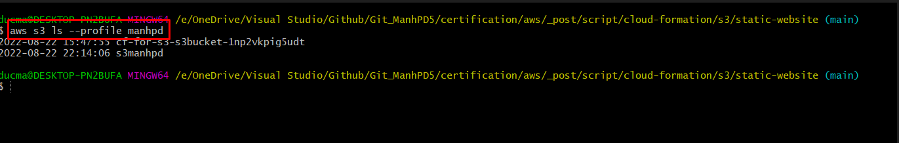
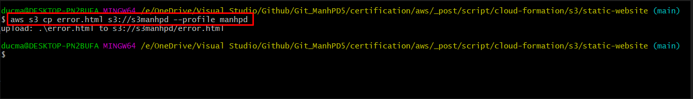
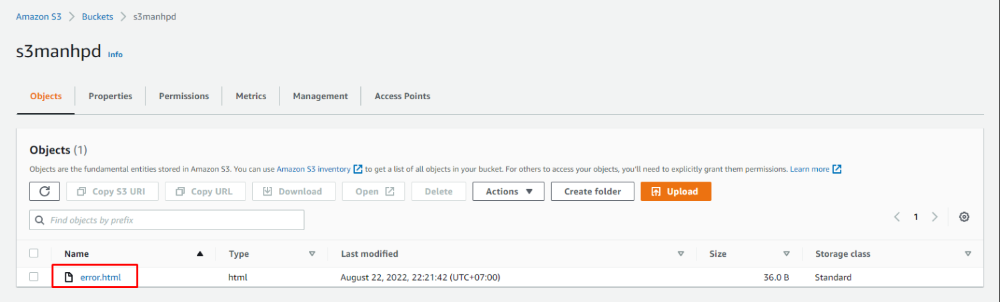
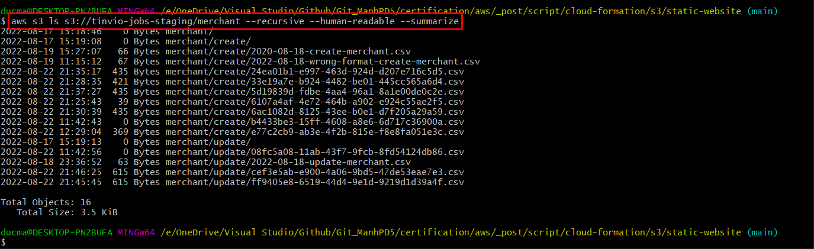

<br>

## Table of contents
- [Some useful commands for Bucket on S3](#some-useful-commands-for-bucket-on-s3)
- [Some useful commands for Files on S3](#some-useful-commands-for-files-on-s3)
- [Wrapping up](#wrapping-up)


<br>

## Some useful commands for Bucket on S3

1. To create a new bucket.

    ```bash
    aws s3 --profile manhpd mb s3://<name-bucket>
    ```

    In this case, we will use `mb` command to make a new bucket. `mb` stands for `make bucket`.

    For example:

    ```bash
    aws s3 --profile manhpd mb s3://test-bucket
    ```

2. To remove a bucket.

    ```bash
    aws s3 --profile manhpd rb s3://<name-bucket> --force
    ```

3. To list all buckets in S3.

    ```bash
    aws s3 --profile manhpd ls
    ```

    Then, we have:

    


<br>

## Some useful commands for Files on S3

1. To copy a file in the local to a bucket in S3.

    ```bash
    aws s3 --profile manhpd cp local-file s3://<name-bucket>
    ```

    For example:

    ```bash
    # create a new text file
    echo "This is file 2" >> sample2.txt

    # Copy this file to S3 bucket
    aws s3 --profile manhpd cp sample2.txt s3://test-bucket
    ```

    For example:

    

    At the same time, checking on S3 bucket - `s3manhpd`, we have:

    

2. To move a local file to a bucket in S3.

    ```bash
    aws s3 --profile manhpd mv local-file s3://<name-bucket>
    ```

3. To move file from S3 to the local

    ```bash
    aws s3 --profile manhpd mv s3://name-bucket/name-file ./
    ```

4. To move a file in S3 bucket.

    ```bash
    aws s3 --profile manhpd mv s3://name-bucket/name-file
    ```

5. To remove a file in S3 bucket.

    ```bash
    aws s3 --profile manhpd rm s3://name-bucket/name-file
    ```

6. To rename a file in S3.

    ```bash
    aws s3 --profile manhpd cp file-path s3://name-bucket/different-name-file
    ```

7. List all files in a bucket.

    ```bash
    aws s3 --profile manhpd ls s3://name-bucket --recursive --human-readable --summarize
    ```

8. List all files in a folder of a bucket.

    ```bash
    aws s3 --profile manhpd ls s3://name-bucket/name-folder --recursive --human-readable --summarize
    ```

    For example:

    

9. List only the filenames of a S3 bucket.

    ```bash
    aws s3api --profile manhpd list-objects --bucket <name-bucket> --output text --query "Contents[].{Key: Key}"
    ```


<br>

## Wrapping up


