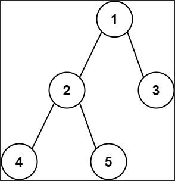

<br>

## Table of contents
- [Given problem](#given-problem)
- [Brute-force solution](#brute-force-solution)
- [Optimized solution 1](#optimized-solution-1)
- [Wrapping up](#wrapping-up)


<br>

## Given problem

Given the root of a binary tree, return the length of the diameter of the tree.

The diameter of a binary tree is the length of the longest path between any two nodes in a tree. This path may or may not pass through the root.

The length of a path between two nodes is represented by the number of edges between them.

1. Example 1

    

    - Input: root = `[1,2,3,4,5]`
    - Output: 3
    - Explanation: 3 is the length of the path `[4,2,1,3]` or `[5,2,1,3]`.

2. Example 2

    - Input: root = `[1,2]`
    - Output: 1


<br>

## Brute-force solution

Below are some steps to solve this problem:
1. Get all leaf nodes of a tree.
2. For each couple of leaf nodes, find their Lowest Common Ancestor and calculate the diameter between them.
3. Compare their diameters with max diameter.

Then, we have the source code:

```Java
public static int findDiameter(TreeNode root) {
    // find all leaf nodes
    List<TreeNode> leafNodes = new ArrayList<>();
    getAllLeafNodes(root, leafNodes);

    // iterate from that list of leaf node and count the number nodes
    int maxDiameter = -1;
    for (int i = 0; i < leafNodes.size() - 1; ++i) {
        for (int j = i + 1; j < leafNodes.size(); ++j) {
            TreeNode leafNode1 = leafNodes.get(i);
            TreeNode leafNode2 = leafNodes.get(j);
            TreeNode commonAncestor = findCommonAncestor(root, leafNode1, leafNode2);

            int currentDiameter = countNodesBetweenTwoLeafNodes(commonAncestor, leafNode1, leafNode2);
            maxDiameter = maxDiameter < currentDiameter ?
                                        currentDiameter : maxDiameter;
        }
    }

    return maxDiameter;
}

private static void getAllLeafNodes(TreeNode root, List<TreeNode> leafNodes) {
    if (root == null) {
        return;
    }

    if (root.left == null && root.right == null) {
        leafNodes.add(root);
        return;
    }

    getAllLeafNodes(root.left, leafNodes);
    getAllLeafNodes(root.right, leafNodes);
}

private static TreeNode findCommonAncestor(TreeNode root, TreeNode leafNode1, TreeNode leafNode2) {
    if (root == null) {
        return null;
    }

    if (root.val == leafNode1.val || root.val == leafNode2.val) {
        return root;
    }

    TreeNode leafLcaNode = findCommonAncestor(root.left, leafNode1, leafNode2);
    TreeNode rightLcaNode = findCommonAncestor(root.right, leafNode1, leafNode2);

    if (leafLcaNode != null && rightLcaNode != null) {
        return root;
    }

    return leafLcaNode == null ? rightLcaNode : leafLcaNode;
}

/**
    *
    * @param root
    * @param leafNode1
    * @param leafNode2
    * @return
    */
private static int countNodesBetweenTwoLeafNodes(TreeNode root, TreeNode leafNode1, TreeNode leafNode2) {
    int numNodesFromFirstSide = numNodes(root, leafNode1);
    int numNodesFromSecondSide = numNodes(root, leafNode2);

    return numNodesFromFirstSide + numNodesFromSecondSide - 1;
}

private static int numNodes(TreeNode root, TreeNode leafNode) {
    if (root == null) {
        return 0;
    }

    if (root == leafNode) {
        return 1;
    }

    int count1 = numNodes(root.left, leafNode);
    int count2 = numNodes(root.right, leafNode);

    if (count1 > 0) {
        return count1 + 1;
    } else if (count2 > 0) {
        return count2 + 1;
    }

    return 0;
}

public static void main(String[] args) {
    TreeNode root1 = buildExample1();
    System.out.println("Tree Diameter: " + TreeDiameter.findDiameterV1(root1));
}

private static TreeNode buildExample1() {
    TreeNode root = new TreeNode(1);
    root.left = new TreeNode(2);
    root.right = new TreeNode(3);
    root.left.left = new TreeNode(4);
    root.right.left = new TreeNode(5);
    root.right.right = new TreeNode(6);

    return root;
}
```

This way can be wrong because we define the diameter of a binary tree is the number of nodes on the longest path betwen any two leaf nodes. But Leetcode uses the number of edges on the longest path between any two nodes.

Take care of using this way. Instead of that, look at the steps we implement.

The complexity of this solution:
- Time complexity: O(n^2)

    In binary tree, the number of leaf nodes is `(n + 1) / 2` with n is the number of nodes.

    For each loop of leaf nodes, we will find the LCA and calculate the diameter by counting the number of nodes between our leaf nodes and their LCA. These operations take `O(n)`.

    So the overall time complexity of this problem is: `O(n^2)`.

- Space complexity: O(n).


<br>

## Optimized solution 1

In this way, we will use the height of a binary tree to calculate the diameter. But there're some important things to note:
- The diameter of a binary tree is the length of the longest path between any two nodes in a tree.
- The length of a path between two nodes is represented by the number of edges between them.
- The height of of binary tree is the height of a root node.

    The height of a node is the number of edges on the longest downward path between that node and a leaf.

    Then, the formular of a tree's height is:

    ```Java
    height = Math.max(the height of left sub-tree, the height of right sub-tree) + 1;
    ```

    We need to add 1 because it's an edge between the left or right sub-tree and its parent node.

So the diameter of a tree is:

```
diameter = (the height of left sub-tree + 1) + (the height of right sub-tree + 1)
         = [(the height of left sub-tree) + (the height of right sub-tree)] + 2
```

Below is the source code of this solution:

```Java
class Solution {

    private int diameter = 0;

    public int diameterOfBinaryTree(TreeNode root) {
        if (root == null ) {
            return 0;
        }

        this.findHeight(root);
        return this.diameter;
    }

    public int findHeight(TreeNode root){
        if (root == null) {
            return -1;
        }

        int leftHeight = this.findHeight(root.left);
        int rightHeight = this.findHeight(root.right);

        this.diameter = Math.max(this.diameter, leftHeight + rightHeight + 2);

        return Math.max(leftHeight, rightHeight) + 1;
    }
}
```

The complexity of this solution:
- Time complexity: O(n)
- Space complexity: O(n)


<br>

## Wrapping up


<br>

Refer:

[543. Diameter of Binary Tree](https://leetcode.com/problems/diameter-of-binary-tree/)
