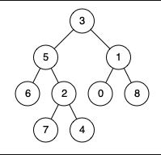
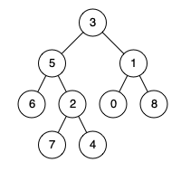

<br>

## Table of contents
- [Given problem](#given-problem)
- [Brute-force Solution](#brute-force-solution)
- [Optimized Solution 1](#optimized-solution-1)
- [Wrapping up](#wrapping-up)


<br>

## Given problem

Given a binary tree, find the lowest common ancestor (LCA) of two given nodes in the tree.

According to the definition of LCA on Wikipedia: "The lowest common ancestor is defined between two nodes p and q as the lowest node in T that has both p and q as descendants (where we allow a node to be a descendant of itself)."

1. Example 1

    

    - Input: root = `[3,5,1,6,2,0,8,null,null,7,4]`, p = 5, q = 1
    - Output: 3
    - Explanation: The LCA of nodes 5 and 1 is 3.

2. Example 2

    

    - Input: root = `[3,5,1,6,2,0,8,null,null,7,4]`, p = 5, q = 4
    - Output: 5
    - Explanation: The LCA of nodes 5 and 4 is 5, since a node can be a descendant of itself according to the LCA definition.

3. Example 3

    - Input: root = `[1,2]`, p = 1, q = 2
    - Output: 1

4. Constraints

    - The number of nodes in the tree is in the range `[2, 105]`.
    - `-109 <= Node.val <= 109`.
    - All Node.val are unique.
    - `p != q`.
    - `p` and `q` will exist in the tree.


<br>

## Brute-force Solution

In the current brute-force solution, it has two points to get:
1. The LCA node will have the same depth from the input nodes p and q.
2. Define additional parent nodes to support get back to the root path.

So the TreeNode data structure will have additional two fields: `parent` and `depth`.

Below is the source code of this solution:

```Java
public TreeNode lowestCommonAncestor(TreeNode root, TreeNode p, TreeNode q) {
    this.preprocessTree(root, new TreeNode(Integer.MIN_VALUE));
    return this.lca(p, q);
}

/**
  * Calculation of the depth and the parent of each node
  *
  * @param root
  */
private void preprocessTree(TreeNode root, TreeNode parent) {
    if (root == null) {
        return;
    }

    root.depth = parent.depth + 1;
    root.parent = parent;

    preprocessTree(root.left, root);
    preprocessTree(root.right, root);
}

/**
  * Find the Lowest Common Ancestor Node of a tree
  *
  * @param p
  * @param q
  * @return
  */
private TreeNode lca(TreeNode p, TreeNode q) {
    Objects.requireNonNull(p);
    Objects.requireNonNull(q);

    while (p.depth != q.depth) {
        if (p.depth > q.depth) {
            p = p.parent;
        } else {
            q = q.parent;
        }
    }

    while (p != q) {
        p = p.parent;
        q = q.parent;
    }

    return p;
}

private TreeNode findNode(TreeNode root, int value) {
    if (root == null) {
        return null;
    }

    if (root.val == value) {
        return root;
    }

    TreeNode tmp1 = findNode(root.left, value);
    TreeNode tmp2 = findNode(root.right, value);

    return tmp1 != null ? tmp1 : tmp2;
}

public static void main(String[] args) {
    LowestCommonAncestor lca = new LowestCommonAncestor();
    TreeNode root = buildExample1();
    TreeNode p = lca.findNode(root, 5);
    TreeNode q = lca.findNode(root, 4);

    TreeNode res = lca.lowestCommonAncestor(root, p, q);
    System.out.println("The LCA: " + res.val);
}
```

The complexity of this solution:
- Time complexity: O(n)
- Space complexity: O(n)


<br>

## Optimized Solution 1

In this solution, we still use DFS to iterate all Tree's nodes. But there are two things to note here:
1. If we found the LCA node from both left and right sub-trees, we will return its parent node.
2. Otherwise, we will return one of the LCA node of the left and right sub-trees when one of them is not equal to null.

Below is our Java source code for this solution:

```Java
public TreeNode lowestCommonAncestor(TreeNode root, TreeNode p, TreeNode q) {
    if (root == null) {
        return null;
    }

    if (root.val == p.val || root.val == q.val) {
        return root;
    }

    TreeNode leftLcaNode = lowestCommonAncestor(root.left, p, q);
    TreeNode rightLcaNode = lowestCommonAncestor(root.right, p, q);

    if (leftLcaNode != null && rightLcaNode != null) {
        return root;
    }

    return leftLcaNode != null ? leftLcaNode : rightLcaNode;
}
```

The complexity of this solution:
- Time complexity: O(n) with n is the number of nodes.

    The maximum number of node is 10^5. By default, we will consider a computer runs 10^8 operations per second.

    So the time of this solution: 10^5 / 10^8 = 10^-3 = 1ms.

- Space complexity: O(n) with n is the number of nodes because we need to maintain these nodes in recursive functions.


<br>

## Wrapping up


<br>

Refer:

[236. Lowest Common Ancestor of a Binary Tree](https://leetcode.com/problems/lowest-common-ancestor-of-a-binary-tree/)
