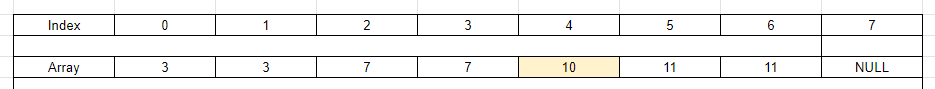
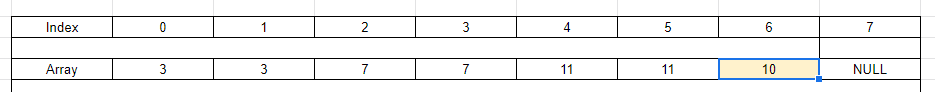
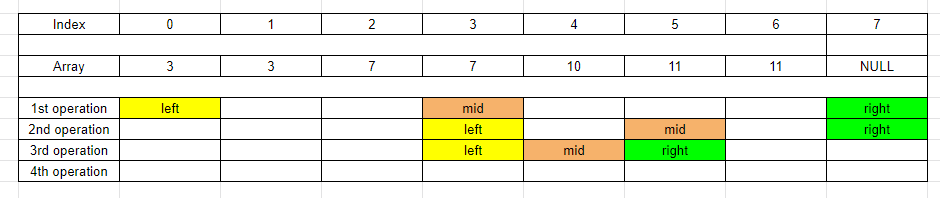
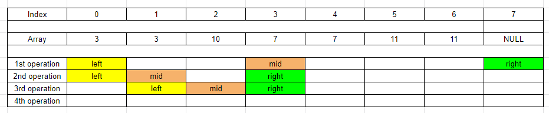
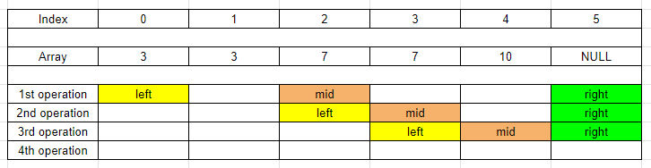

<br>

## Table of contents
- [Given problem](#given-problem)
- [Using XOR bitwise operator](#using-xor-bitwise-operator)
- [Using Binary Search algorithm](#using-binary-search-algorithm)
- [Wrapping up](#wrapping-up)


<br>

## Given problem

You are given a sorted array consisting of only integers where every element appears exactly twice, except for one element which appears exactly once.

Return the single element that appears only once.

Your solution must run in `O(log n)` time and `O(1)` space.

Example 1:
- Input: nums = `[1,1,2,3,3,4,4,8,8]`
- Output: 2

Example 2:
- Input: nums = `[3,3,7,7,10,11,11]`
- Output: 10

Constraints:
- `1 <= nums.length <= 105`
- `0 <= nums[i] <= 105`


<br>

## Using XOR bitwise operator

When reading the problem statement, the property of elements is that each element appears twice. To take advantage of this property, we can use XOR bitwise operator for all elements. Just because applying two same elements with XOR operator will be 0.

To understand why we have this property, we need to look at the formulation:
- 1 + 1 = 0
- 0 + 0 = 0
- 0 + 1 = 1
- 1 + 0 = 1

For example: 3 = 1100 => 1100 + 1100 = 0000

To know more about the bitwise operations, we can look at the following article [Bit manipulation](https://ducmanhphan.github.io/2020-03-25-Bit-manipulation/).

Below is our source code:

```Java
class Solution {
    public int singleNonDuplicate(int[] nums) {
        int singleNum = 0;
        for (int i : nums) {
            singleNum ^= i;
        }
        
        return singleNum;
    }
}
```

The complexity of this solution is:
- Time complexity: `O(n)`.
- Space complexity: `O(1)`.


<br>

## Using Binary Search algorithm

1. Analysis

    Due to the sorted array, Binary Search can be applied in this case. We will choose the third invariant of Binary Search.

    - Our requirement is to find the element's value that is repeated one time.

        So we need to seek the conditions that relates to `mid` pointer in Binary Search algorithm.

        Below are the two cases that our value is satisfied the conditions of `mid` pointer.
        - The `mid` will be at the middle of the array.

            

            In this case, the element with value `10` is compared with its adjacent elements. So our result will be:

            ```Java
            int left = 0;
            int right = nums.length;

            ...

            int mid = left + (right - left) / 2;
            if (nums[mid] != nums[mid - 1] && nums[mid] != nums[mid + 1]) {
                return nums[mid];
            }
            ```

        - But we have another edge case. How about the element with value `10` sit at the end of the array?

            

            The `mid + 1` will lead to the NullPointerException. So we will have the below segment code:

            ```Java
            if (nums[mid] != nums[mid - 1] && mid + 1 == nums.length) {
                return nums[mid];
            }
            ```

            Why do we have these conditions?

            Each element will be repeated twice. The `left` pointer always point to the last element that satisfies this condition. When the `mid` points to last element of the array, it means that the remaining elements satisfied this condition. 

            Therefore, the element at the `mid` position will be need to check.

    - Which condition will we move the `right`, `left` pointers?

        Because the characteristic of this problem is that each element will be repeated twice. So it affects to the odd/even index of each element in the array.

        - If `mid` points to the odd index, we only need to compare the elements at `mid` and `mid - 1` positions.

            - Case 1:

                

            - Case 2:

                

            So we have:

            ```Java
            int mid = left + (right - left) / 2;

            if (mid %2 != 0 && nums[mid] == nums[mid - 1]) {
                left = mid;
            } else {
                right = mid;
            }
            ```

        - If `mid` points to the even index, we only need to compare the elements at `mid` and `mid + 1` positions.

            - Case 1:

                

            - Case 2:

                

            So we have:

            ```Java
            int mid = left + (right - left) / 2;

            if (mid %2 == 0 && nums[mid] == nums[mid + 1]) {
                left = mid;
            } else {
                right = mid;
            }
            ```

2. Solution

    ```Java
    class Solution {
        public int singleNonDuplicate(int[] nums) {
            int left = 0;
            int right = nums.length;

            while (left + 1 < right) {
                int mid = left + (right - left) / 2;

                if (nums[mid] != nums[mid - 1] && (mid + 1 == nums.length || nums[mid] != nums[mid + 1])) {
                    return nums[mid];
                } else if ((mid % 2 == 0 && nums[mid] == nums[mid + 1]) || (mid % 2 != 0 && nums[mid] == nums[mid - 1])) {
                    left = mid;
                } else {
                    right = mid;
                }
            }

            return nums[left];
        }
    }
    ```

    The complexity of this solution is:
    - Time complexity: `O(logn)`.
    - Space complexity: `O(1)`.


<br>

## Wrapping up


<br>

Refer:

[540. Single Element in a Sorted Array](https://leetcode.com/problems/single-element-in-a-sorted-array/description/)
