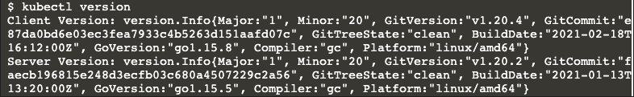
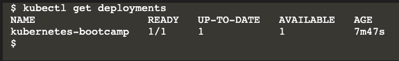

<br>

## Table of contents
- [Introduction to kubectl](#introduction-to-kubectl)
- [Basic commands in Kubectl](#basic-commands-in-kubectl)
- [Deploy commands in Kubectl](#deploy-commands-in-kubectl)
- [Cluster management commands](#cluster-management-commands)
- [Troubleshooting and debugging commands](#troubleshooting-and-debugging-commands)
- [Advanced commands](#advanced-commands)
- [Wrapping up](#wrapping-up)


<br>

## Introduction to kubectl

The **kubectl** command line tool lets you control Kubernetes clusters. For configuration, **kubectl** looks for a file named config in the **$HOME/.kube** directory. You can specify other kubeconfig files by setting the **KUBECONFIG** environment variable or by setting the **--kubeconfig** flag.

The common format of a **kubectl** command is:

```bash
kubectl <action> <resource> <name-resource>
```

This performs the specified action (like create, describe) on the specified resource (like node, container) with its name.

To know more about resource types, we can following the [link](https://kubernetes.io/docs/reference/kubectl/overview/#resource-types).


<br>

## Basic commands in Kubectl

Belows are some basic **kubectl** commands:

0. Check version of kubernetes clusters

    If you want to check client and server's version of Kubernetes cluster, use this command.

    ```bash
    kubectl version
    ```

    For example:

    

1. Create a resource for cluster

    Create a resource from a file or from **stdin**.

    For example, create a Kubernetes deployment from the file.

    ```bash
    kubectl create <resource-name>
    ```

    For example:
    - let's deploy our app on kubernetes with the deployment name and app image location

        ```bash
        kubectl create deployment kubernetes-bootcamp --image=gcr.io/google-samples/kubernetes-bootcamp:v1
        ```

        This performed a few things for you:
        - searched for a suitable node where an instance of the application could be run.
        - scheduled the application to run on that Node.
        - configured the cluster to reschedule the instance on a new Node when needed.


2. View the resources in the cluster

    ```bash
    kubectl get <resource-name>
    ```

    For example:
    - View the nodes in the cluster

        ```bash
        kubectl get nodes
        ```

    - View our deployments

        ```bash
        kubectl get deployments
        ```

        Then, we have:

        

    - Get a list of running pods or the YAML output of a pod.

3. Run a particular image on the cluster

    ```bash
    kubectl run 
    ```

4. Set specific features on on objects

    ```bash
    kubectl set
    ```

    For example:
    - set environment variables
    - update a Docker image in a pod template
    - ...

5. Take a service, deployment, or pod and expose it as a new Kubernetes Service

    ```bash
    kubectl expose
    ```

6. Get the documentation of resources

    ```bash
    kubectl explain
    ```

    For example:
    - the documentation on deployments

7. Edit a resource

    ```bash
    kubectl edit
    ```

    For example:
    - edit a deployment

8. Delete resources by filenames, stdin, resources, and names, or by resources and label selectors

    ```bash
    kubectl delete
    ```


<br>

## Deploy commands in Kubectl

1. Manage the rollout of a resource

    ```bash
    kubectl rollout
    ```

2. Set a new size for a deployment, ReplicaSet, or StatefulSet

    ```bash
    kubectl scale
    ```

3. Auto-scale a deployment, ReplicaSet, or StatefulSet

    ```bash
    kubectl autoscale
    ```


<br>

## Cluster management commands

1. Modify certificate resources

    ```bash
    kubectl certificate
    ```

2. Display cluster information

    ```bash
    kubectl cluster-info
    ```

3. Display resource (CPU/memory/storage) usage

    ```bash
    kubectl top
    ```

4. Mark a node as unschedulable

    ```bash
    kubectl cordon
    ```

5. Mark a node as schedulable

    ```bash
    kubectl uncordon
    ```

6. Drain a node in preparation for maintenance

    ```bash
    kubectl drain
    ```

7. Update the taints on one or more nodes

    ```bash
    kubectl taint
    ```


<br>

## Troubleshooting and debugging commands

1. Show the details of a specific resource or group of resources

    ```bash
    kubectl describe
    ```

2. Print the logs for a container in a pod

    ```bash
    kubectl logs
    ```

3. Attach to a running container

    ```bash
    kubectl attach
    ```

4. Execute a command in a container

    ```bash
    kubectl exec
    ```

5. Forward one or more local ports to a pod

    ```bash
    kubectl port-forward
    ```

6. Run a proxy to the Kubernetes API server

    ```bash
    kubectl proxy
    ```

7. Copy files and directories to and from containers

    ```bash
    kubectl cp
    ```

8. Inspect authorization

    ```bash
    kubectl auth
    ```


<br>

## Advanced commands

1. Show difference of live version against a would-be applied version

    ```bash
    kubectl diff
    ```

2. Apply a configuration to a resource by filename or stdin

    ```bash
    kubectl apply
    ```

3. Update the fields of a resource using a strategic merge patch

    ```bash
    kubectl patch
    ```

4. Replace a resource by filename or stdin

    ```bash
    kubectl replace
    ```

5. Wait for a specific condition on one or many resources

    ```bash
    kubectl wait
    ```

6. Convert config files between different API versions

    ```bash
    kubectl convert
    ```

7. Build a customization target from a directory or a remote URL

    ```bash
    kubectl kustomize
    ```


<br>

## Wrapping up


<br>

Refer:

[https://kubernetes.io/docs/reference/kubectl/cheatsheet/](https://kubernetes.io/docs/reference/kubectl/cheatsheet/)
