 

## Table of contents
- [Given problem](#given-problem)
- [VPC](#vpc)

    - [Introduction to VPC](#introduction-to-vpc)
    - [Limitations of VPC](#limitations-of-vpc)
    - [Some questions for VPC](#some-questions-for-vpc)

- [Subnets](#subnets)

    - [Public Subnets](#public-subnets)
    - [Private Subnets](#private-subnets)
    - [CIDR](#cidr)
    - [Router Tables](#router-tables)

- [How to configure VPC and Subnets](#how-to-configure-vpc-and-subnets)

    - [Configuration for VPC](#configuration-for-vpc)
    - [Configuration for Subnets](#configuration-for-subnets)

- [Wrapping up](#wrapping-up)

 

## Given problem

Nowadays, most of the projects will be deployed on Cloud. Some cloud providers that we know such as Amazon Web Service, Google Cloud, Azure, ... After some steps like analyze domains, design systems, and choose tech stacks and cloud providers, we will need to design the infrastructure of our system on the cloud.

Today, we will learn the VPC - Virtual Private Network that is the important part in AWS. And how to create it by using AWS Management Console. Our design will be looked like the below image.

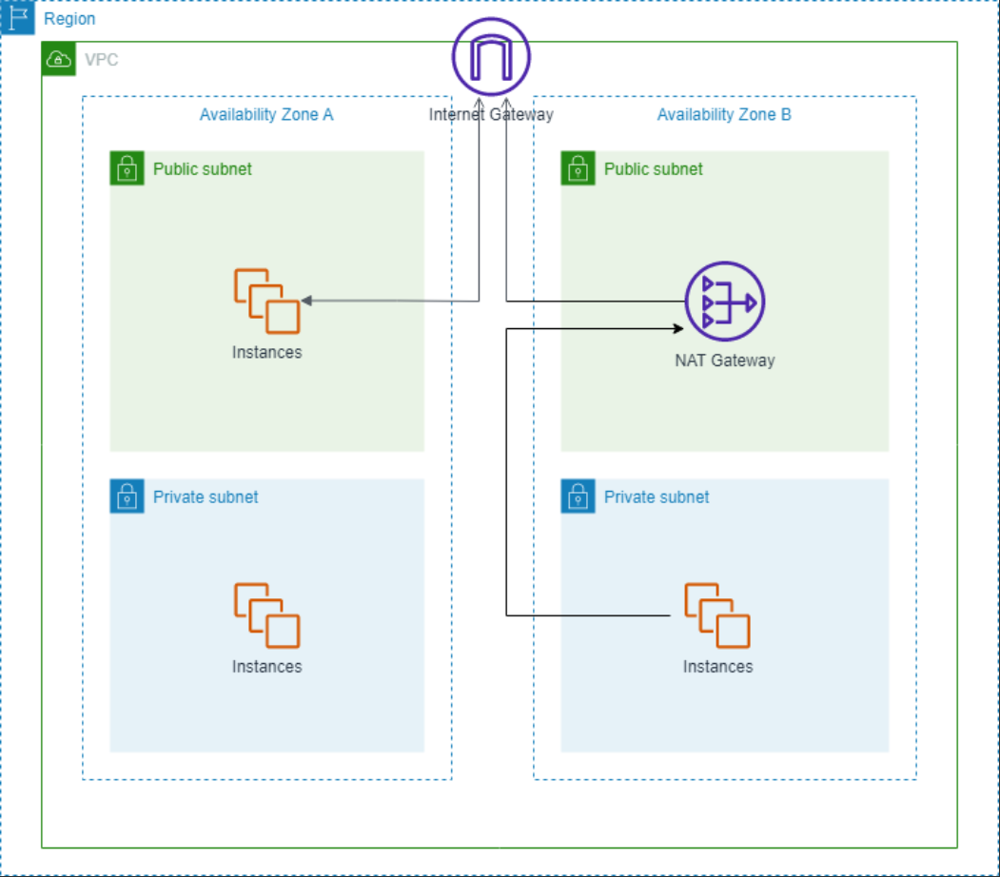

 

## VPC

### Introduction to VPC

VPC is an acronym for "Virtual Private Cloud". To understand this concept, we need to go into each word like **Virtual** and **Private**.
- **Virtual**.

    AWS will provide services like EC2, S3, SQS, ... to different customers. It means that these customers can use the same infrastructure like hardware, network, ... But these customers will have different demands like, with OS, they want to use Windows, Linux. So AWS will use the virtual technologies to support it. To make it easy to digest, we can think of the virtual machines like Virtual Box, VMWare.

- **Private**.

    Due to the security factor, each customer will want our service isolates to others. So it provides the mechanisms like encrypted connections, to secure their customers' systems.

Therefore, from the above parts, VPC is a private network within AWS. We will deploy our services in VPC.

Some notes of VPC:
- If we don't create any other VPC, AWS provides the default VPC.
- A VPC will exists in one region.

    We can not setup a VPC spans different regions.

- Due to the fact that a region has multiple Availability Zones, a VPC can span AZs in one region.

    From the above image in [Given problem](#given-problem) section, we can see that VPC can span Availability Zone A and Availability Zone B.

### Limitations of VPC

- By default, there are 5 VPCs/Region.

### Some questions for VPC

1. Why do we need VPC?

    From the explainations in [Introduction to VPC](#introduction-to-vpc) section, we can have answer for this question.

2. Why AWS allows only 5 VPCs/Region?

    When searching this question, I found [the answer that gives the reasonable ideas](https://qr.ae/pKlIar):
    - Limiting resource consumption.
    - Encouraging best practices.
    - Promoting modular design.
    - Simplifying management.

    --> But the other question appears in my mind: **Why the default number of VPC is 5? Why not 2, 3, 4, or other nunmbers?**

 

## Subnets

After setup VPC completely, the next step is setup its subnets. Subnet is a way that you partition your network inside a VPC. Based on that, each resource will be assigned an IP address. Then, they can communicate with each other, or with Internet through Internet Gateway - mapping the local IP to real IP on Internet and vice versa.

There are two tyes of subnets:
1. Public subnets.
2. Private subnets.

### Public Subnets

Public subnet is a subnet that is accessiable from Internet, and vice versa.

### Private Subnets

Private subnet is a subnet that is not accessible from Internet.

### CIDR

CIDR stands for **Classless Inter-Domain Routing**. It will be used to allocate the IP addresses to resources in a subnet.

Before going into the meaning of CIDR, we need to walk through the classful addresses of IP addres. IP address, like 192.168.1.0, consists of 32 bits. Each number was separated by a dot, and has value from 0 - (2^8 - 1).

Below are 3 classful addreses of IP address.
- Class A.

    A Class A IPv4 address has 8 network prefix bits. The first bit in this octet is always `0`. So the range value of this octet, or the network address is from 1 - (2^7 - 1).

    For example:
    - 12.0.0.1

        `12` is the network addres and `0.0.1` is the host address.

- Class B.

    A Class B IPv4 address has 16 network prefix bits. The first two bits in the first octet are always `10`. So the range value of this octet, or the network address is from 128 to 191.

    For example:
    - 128.12.0.1

        `128.12` is the network addres and `0.1` is the host address.

- Class C.

    A Class C IPv4 address has 24 network prefix bits. The first three bits in the first octet are always `110`. So the range value of this octet, or the network address is from 192 to 233.

    For example:
    - 192.168.1.10

        `192.168.1` is the network addres and `10` is the host address.

Without using classful addres concepts, it will use the suffix number to point the number of bits for network address.

For example:
- CIDR: 192.168.1.0/24

    24 will be used for network address. Or the remaining bits are 8 bits that use for host address.

From that, this is a good way to manage the number of IP addreses efficiently, like our services will have 3 instances for now, then we can use CIDR suffix is 28. So the 4 bits will be used for host address, corresponding 16 host addresses.

### Router Tables

After configured the VPC, subnets for our resources, the questions:
- How do resources in each subnet access to outside, and vice versa? 
- Which part will handle this issue?

Router table will appear to solve it. It will define the data packet's flow of resources.

Each subnet in a VPC will have a route table. The multiple subnets can point to the one route table.

A route table consists of a set of rules. They are called routes. A route consists of a destination and a target.

- A destination is the IP range that sent data.
- A target is the network interface that is received data.

|  Destination  |   Target   |
| ------------- | ---------- |
| 10.0.0.0/16   | local      |
| 0.0.0.0/0     | igw        |

 

## How to configure VPC and Subnets

### Configuration for VPC

Go to the AWS Management Console. Then, search VPC, we have:

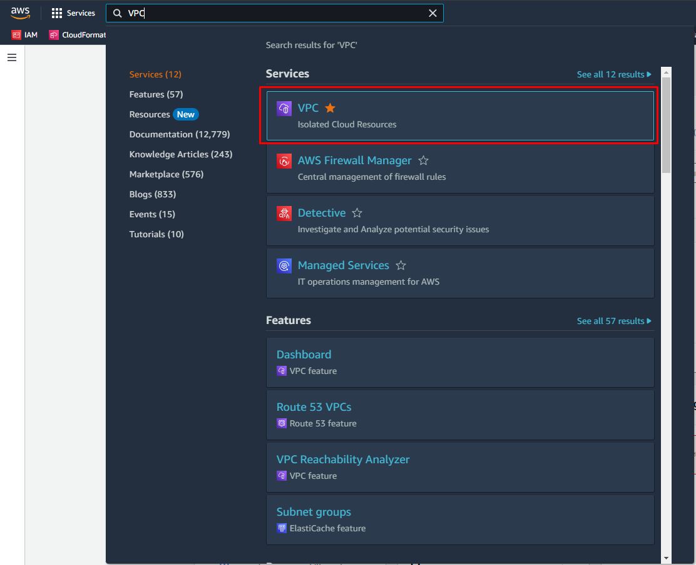

Click to **VPC** service, we have:

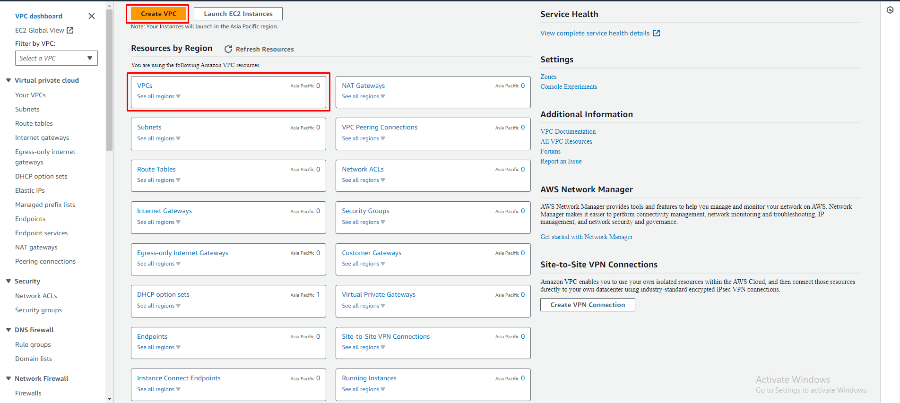

In this screen, click on the **Create VPC** button.

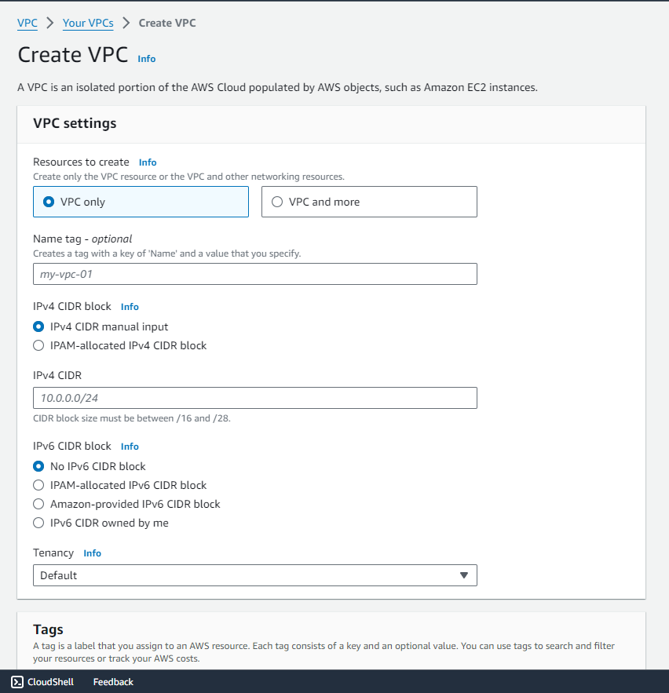

Because this is a guide step-by-step, so we will create only VPC resource, not other resources. Subnets will be created in the below section.

Below is the configuration for the VPC:

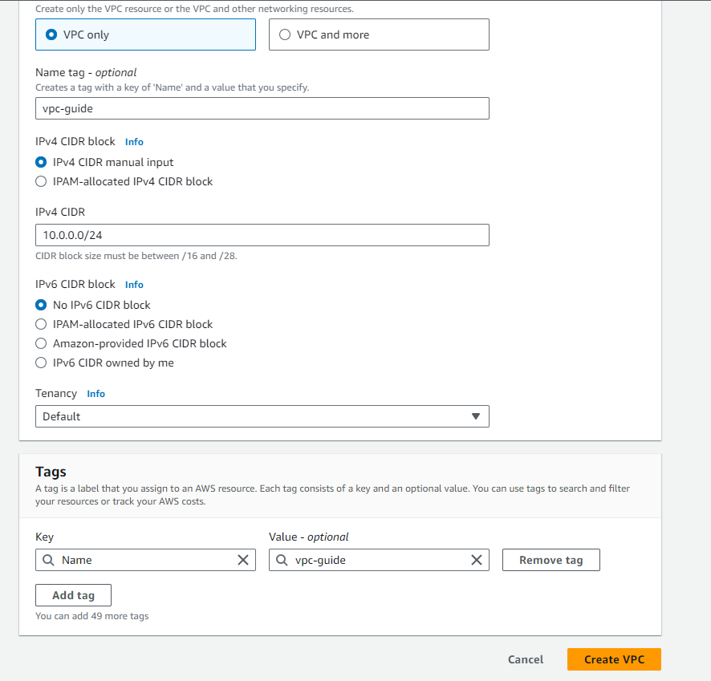

Notes for **Tenancy** field.

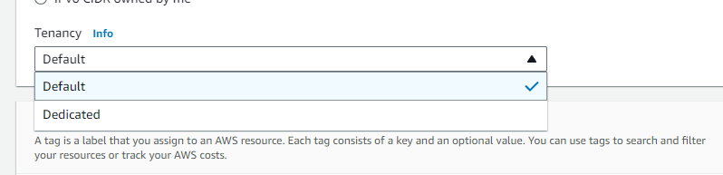

There are two types of Tenancy:
- **Default**.

    This is the ubiquitous used configuration. It means that multiple customers will use the same hardware. Its cost is quite cheap, but the **noisy neighbor effect** is happened. It means that an account's resources can affect to the performance of resources of other account.

- **Dedicated**.

    Our resources will use the separated hardware with other accounts.

Click on the **Create VPC** button to complete the configuration for VPC.

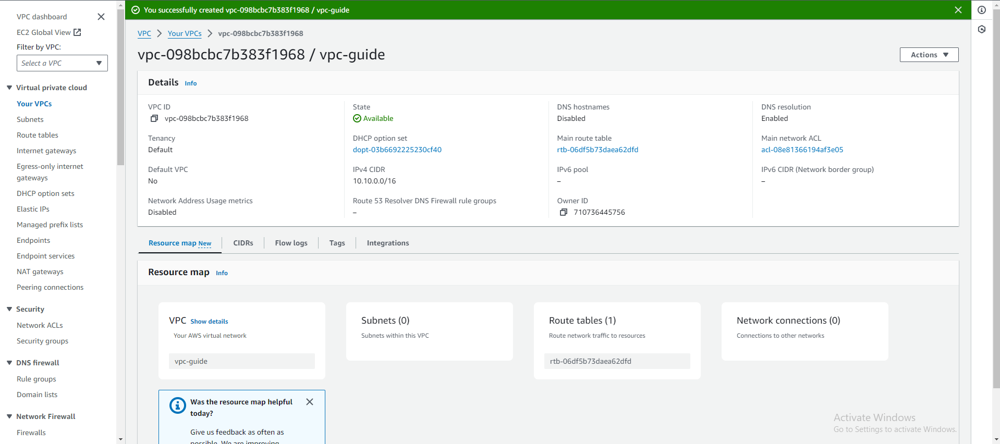

### Configuration for Subnets

Firstly, according to the infrastructure that we want to create, there're 2 public subnets, and 2 private subnets. Each pair of public subnet and private subnet will be put in one availability zone of region - Singapore.

To move to **Subnets** screen, choose **Subnets** item on the left-hand side.

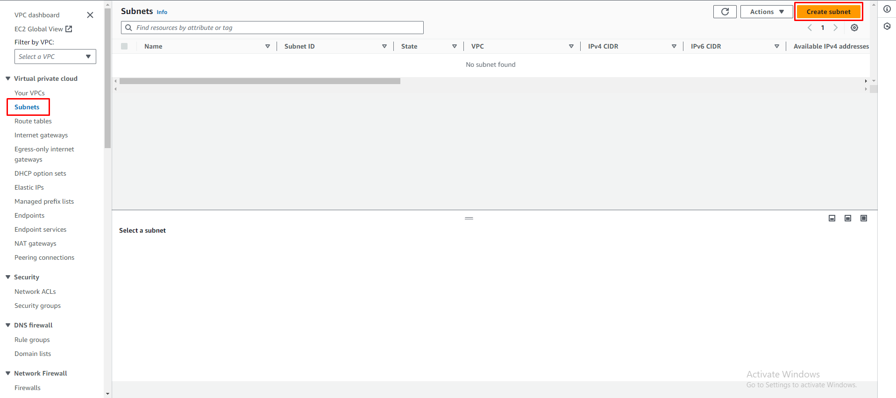

Click on **Create subnet** button, we have:

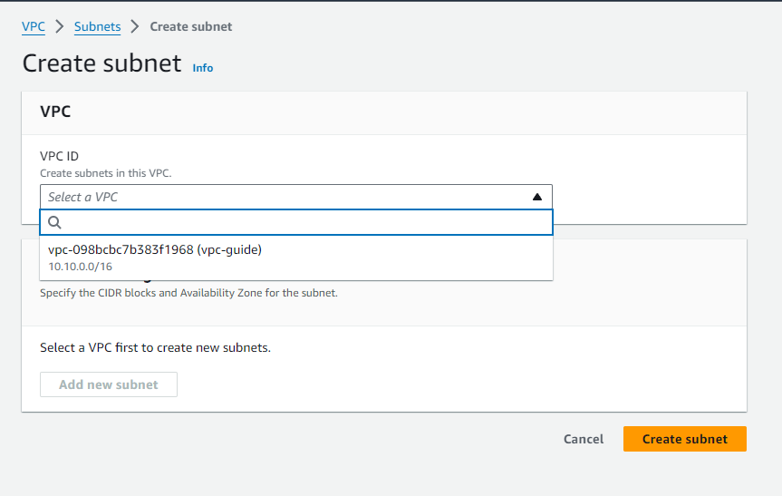

In the drop-down of **VPC ID**, choose **vpc-guide**. Then, we have:

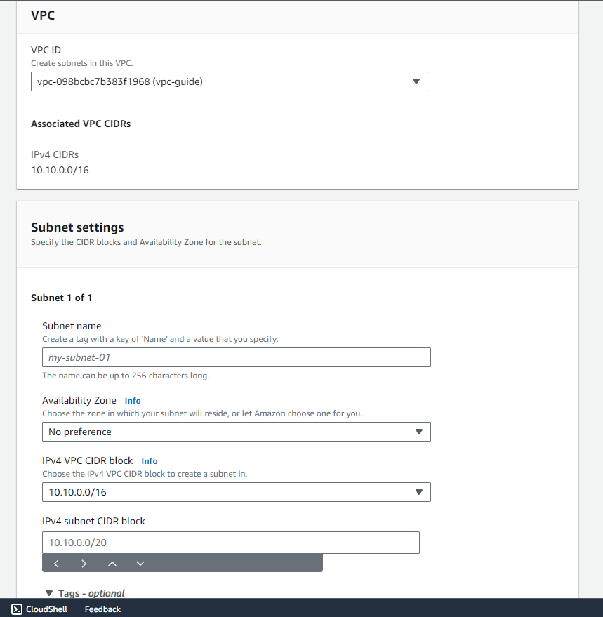

Next, fill the information of this public subnet like the below image:

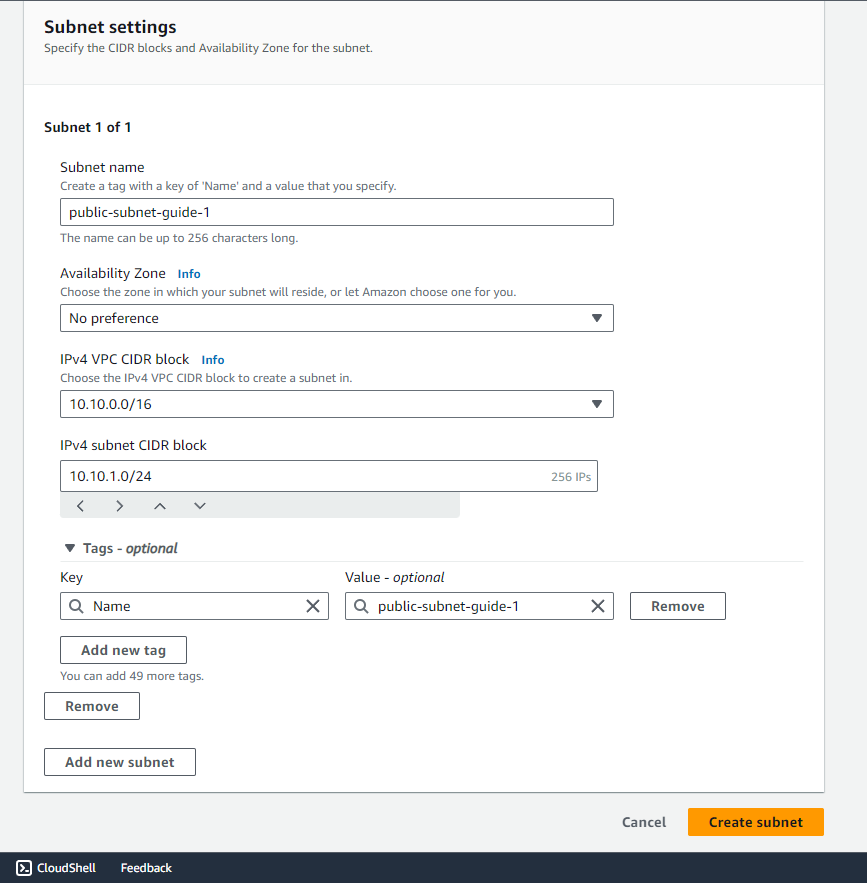

Click on **Create subnet** button, we have:

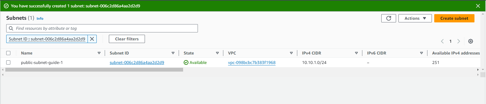

Repeat these steps above for the second public subnet and 2 private subnets, we have:

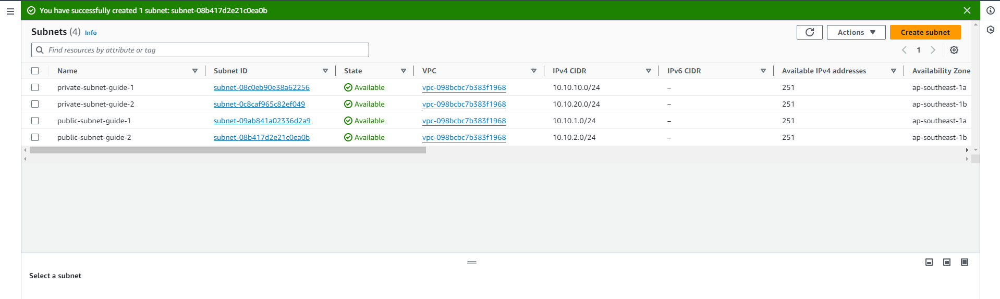

 

## Wrapping up

