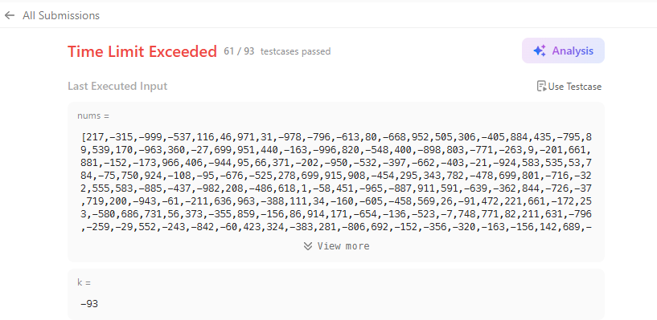

<br>

## Table of contents
- [Given problem](#given-problem)
- [Using Brute Force](#using-brute-force)
- [Using Prefix Sum + Hash Map](#using-prefix-sum--hash-map)
- [Wrapping up](#wrapping-up)


<br>

## Given problem

Given an array of integers nums and an integer k, return the total number of subarrays whose sum equals to k.

A subarray is a contiguous non-empty sequence of elements within an array.

Example 1:

- Input: `nums = [1,1,1]`, `k = 2`.
- Output: 2.

Example 2
- Input: `nums = [1,2,3]`, `k = 3`.
- Output: 2.

Constraints:

- `1 <= nums.length <= 2 * 104`.
- `-1000 <= nums[i] <= 1000`.
- `-107 <= k <= 107`.


<br>

## Using Brute Force

In this way, we will use brute force to iterate the sum of all subarrays. Then we will compare it with `k` to count the number of subarrays.

```Java
class Solution {
    public int subarraySum(int[] nums, int k) {
        int count = 0;

        for (int start = 0; start < nums.length; ++start) {
            for (int end = start + 1; end <= nums.length; ++end) {
                int sum = 0;
                for (int i = start; i < end; ++i) {
                    sum += nums[i];
                }

                if (sum == k) {
                    ++count;
                }
            }
        }

        return count;
    }
}
```

The complexity of this solution:

- Time complexity: O(n^3).
- Space complexity: O(1).

When running this solution on the Leetcode, it encounter TLE:



To improve this solution, we will use Prefix Sum that has already calculated the sum of a subarray, instead of using the inner 3rd for loop.

```Java
class Solution {
    public int subarraySum(int[] nums, int k) {
        int count = 0;

        // Initialize Prefix Sum array
        int[] prefixSum = new int[nums.length + 1];
        Arrays.fill(prefixSum, 0);

        for (int i = 0; i < nums.length; ++i) {
            prefixSum[i + 1] = prefixSum[i] + nums[i];
        }

        // Count the number of subarrays
        for (int start = 0; start < nums.length; ++start) {
            for (int end = start + 1; end <= nums.length; ++end) {
                int currentSum = prefixSum[end] - prefixSum[start];

                if (currentSum == k) {
                    ++count;
                }
            }
        }

        return count;
    }
}
```

The complexity of this solution:

- Time complexity: O(n^2).
- Space complexity: O(n).

This solution passed in Leetcode.


<br>

## Using Prefix Sum + Hash Map

```Java
class Solution {
    public int subarraySum(int[] nums, int k) {
        int count = 0;

        // Initialize Prefix Sum array
        int[] prefixSum = new int[nums.length + 1];
        Arrays.fill(prefixSum, 0);

        for (int i = 0; i < nums.length; ++i) {
            prefixSum[i + 1] = prefixSum[i] + nums[i];
        }

        // Count the number of subarrays
        Map<Integer, Integer> mp = new HashMap<>();
        for (int i = 0; i < prefixSum.length; ++i) {
            int target = prefixSum[i] - k;

            if (mp.containsKey(target)) {
                count += mp.get(target);
            }

            mp.put(prefixSum[i], mp.getOrDefault(prefixSum[i], 0) + 1);
        }

        return count;
    }
}
```

The complexity of this solution:

- Time complexity: O(n).
- Space complexity: O(n).

This solution is accepted in Leetcode.


<br>

## Wrapping up


<br>

Refer:

[560. Subarray Sum Equals K](https://leetcode.com/problems/subarray-sum-equals-k/)