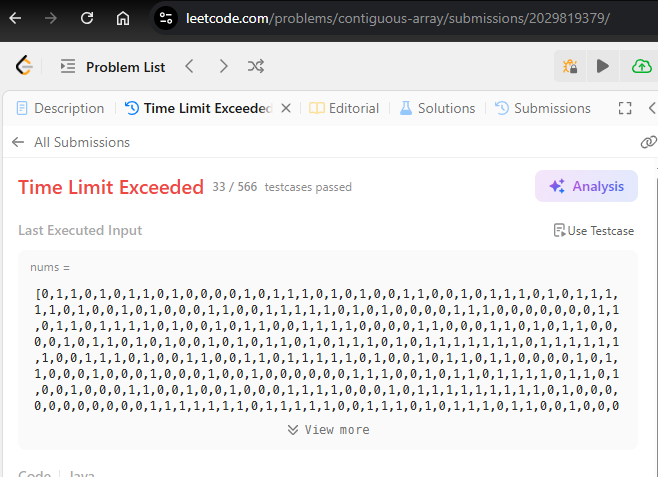
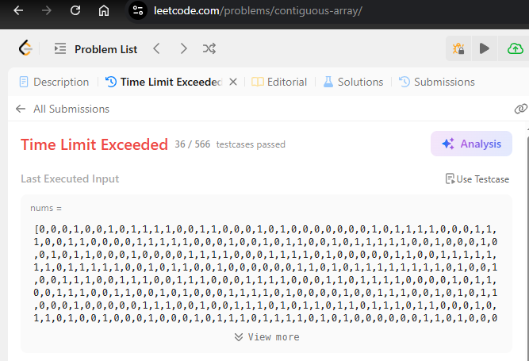

<br>

## Table of contents
- [Given problem](#given-problem)
- [Using Brute Force](#using-brute-force)
- [Using Prefix Sum + HashMap](#using-prefix-sum--hashmap)
- [Wrapping up](#wrapping-up)


<br>

## Given problem

Given a binary array `nums`, return the maximum length of a contiguous subarray with an equal number of `0` and `1`.

Example 1:
- Input: `nums = [0,1]`.
- Output: `2`.
- Explanation: `[0, 1]` is the longest contiguous subarray with an equal number of `0` and `1`.

Example 2:
- Input: `nums = [0,1,0]`.
- Output: `2`.
- Explanation: `[0, 1]` (or `[1, 0]`) is a longest contiguous subarray with equal number of `0` and `1`.

Example 3:
- Input: `nums = [0,1,1,1,1,1,0,0,0]`.
- Output: `6`.
- Explanation: `[1,1,1,0,0,0]` is the longest contiguous subarray with equal number of `0` and `1`.

Constraints:

- `1 <= nums.length <= 10^5`.
- `nums[i]` is either `0` or `1`.


<br>

## Using Brute Force

In this way, we will use 3 loops to iterate all subarrays. In each subarray, we will count the number of `0`s and `1`s.

```Java
class Solution {
    public int findMaxLength(int[] nums) {
        int maxLength = 0;

        for (int start = 0; start < nums.length; ++start) {
            for (int end = start + 1; end <= nums.length; ++end) {
                int numOf0s = 0;
                int numOf1s = 0;

                for (int i = start; i < end; ++i) {
                    if (nums[i] == 0) {
                        ++numOf0s;
                    } else {
                        ++numOf1s;
                    }
                }

                if (numOf0s == numOf1s) {
                    maxLength = Math.max(maxLength, end - start);
                }
            }
        }

        return maxLength;
    }
}
```

The complexity of this solution:

- Time complexity: `O(n^3)`.
- Space complexity: `O(1)`.

It encountered the TLE on the Leetcode.



Instead of using 3 loops, we will use Prefix Sum to reduce the time complexity to `O(n^2)`. Then, due to the fact that the number of 0s will be equal to the number of `1`s, if we change the element `0`s to `-1`s, the sum of all elements `-1`s and `1`s will be `0`. This is the tips to solve it. It makes the sum of all elements easier than using sum and the divide by 2.

```Java
class Solution {
    public int findMaxLength(int[] nums) {
        int maxLength = 0;

        for (int i = 0; i < nums.length; ++i) {
            if (nums[i] == 0) {
                nums[i] = -1;
            }
        }

        int[] prefixSum = new int[nums.length + 1];
        for (int i = 0; i < nums.length; ++i) {
            prefixSum[i + 1] = prefixSum[i] + nums[i];
        }

        for (int start = 0; start < nums.length; ++start) {
            for (int end = start + 1; end <= nums.length; ++end) {
                int sum = prefixSum[end] - prefixSum[start];

                if (sum == 0) {
                    maxLength = Math.max(maxLength, end - start);
                }
            }
        }

        return maxLength;
    }
}
```

The complexity of this solution:

- Time complexity: `O(n^2)`.
- Space complexity: `O(n)`.

But it still runs into TLE on Leetcode.



Next, we have the other brute force solution but use only 2 loops.

```Java
class Solution {
    public int findMaxLength(int[] nums) {
        int maxLength = 0;

        for (int i = 0; i < nums.length; i++) {
            int numOf0s = 0;
            int numOf1s = 0;

            for (int j = i; j < nums.length; j++) {
                if (nums[j] == 0) {
                    numOf0s++;
                } else {
                    numOf1s++;
                }

                if (numOf0s == numOf1s) {
                    maxLength = Math.max(maxLength, j - i + 1);
                }
            }
        }

        return maxLength;
    }
}
```

The complexity of this solution:

- Time complexity: `O(n^2)`.
- Space complexity: `O(1)`.


<br>

## Using Prefix Sum + HashMap

```Java
class Solution {
    public int findMaxLength(int[] nums) {
        // Convert the element 0s to -1s
        for (int i = 0; i < nums.length; ++i) {
            if (nums[i] == 0) {
                nums[i] = -1;
            }
        }

        // Calculate the prefix sum array
        int[] prefixSum = new int[nums.length + 1];
        for (int i = 0; i < nums.length; ++i) {
            prefixSum[i + 1] = prefixSum[i] + nums[i];
        }

        // Find the longest subarray
        Map<Integer, Integer> mp = new HashMap<>();
        int maxLength = 0;

        for (int i = 0; i < prefixSum.length; ++i) {
            int currentSum = prefixSum[i];

            if (mp.containsKey(currentSum)) {
                maxLength = Math.max(maxLength, i - mp.get(currentSum));
            }

            mp.putIfAbsent(currentSum, i);
        }

        return maxLength;
    }
}
```

The complexity of this solution:

- Time complexity: `O(n)`.
- Space complexity: `O(n)`.

It passed on the Leetcode.


Instead of using Prefix Sum array, we will optimize it with an variable.

```Java
class Solution {
    public int findMaxLength(int[] nums) {
        int maxLength = 0;

        Map<Integer, Integer> mp = new HashMap<>();
        mp.put(0, -1); // Element has 0 value will be corrssponding -1

        int prefixSum = 0;

        for (int i = 0; i < nums.length; ++i) {
            prefixSum += (nums[i] == 1) ? 1 : -1;

            if (mp.containsKey(prefixSum)) {
                maxLength = Math.max(maxLength, i - mp.get(prefixSum));
            } else {
                mp.put(prefixSum, i);
            }
        }

        return maxLength;
    }
}
```


<br>

## Wrapping up


<br>

Refer:

[525. Contiguous Array](https://leetcode.com/problems/contiguous-array/description/)
